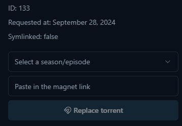

# **The Item Page**

This is a guide to the features found on the single item page. This page
displays an item that you browsed or added to your library.

## **Manually adding torrents**

Torrents can be manually added in one of two ways:

 - Replacing the torrent of an already existing item in the library using a magnet link
 - Replacing or adding a torrent using the "Scrape" button

### Using the "Scrape" button

Upon clicking this button the item will be scraped using the configured scraping services. A dialog
will pop up that shows the user the available torrents. The user can add a torrent using the "+" button
on the right-hand side of each row.

Each row also displays the rank from the [RTN](https://github.com/dreulavelle/rank-torrent-name) package that Riven uses
to rank the torrents. It uses the ranking settings the user configured on the backend.

If the torrent is cached on a downloader service, the dialog will close and a success message will be displayed
on the bottom right corner of the screen. If the item hasn't yet been added to the library, it will be indexed and added.
Otherwise, the current torrent for the item will be replaced and newly symlinked.

There is also a chance the torrent isn't cached on a downloader service. Then the program will display an error message
and the dialog will stay open.

### Using the "Replace torrent" button

This option can only be accessed on an item that was already added to the user's library. You can access the sidebar
by clicking the "Manage" button on the main page. 

If the item is a show, a dropdown will be shown where the user can select which season/episode they want to replace
with the torrent. Otherwise, only the magnet text box will be shown. The same principles that were discussed in
the "Using the Scrape button" apply to when the torrent will be actually added to the item.

